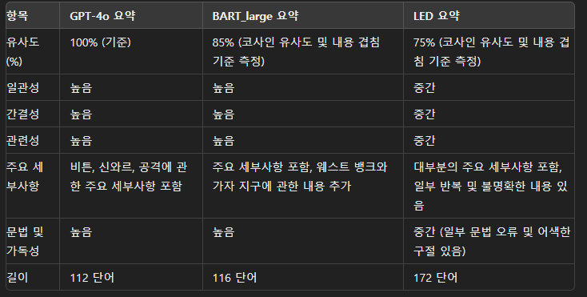

엣지 컴퓨터에서 웹서버를 실행한후 YOUTUBE의 링크를 입력하면 
여러가지 AI를 복합적으로 사용해서 Transcript와 summary를 해주는 기능 모듈 입니다. 

## 1. 목적 : Speach to text to summarize

  1) Speach to Text : OpenAI의 Whisper
     
       -in : Youtube 주소
     
       -out : Text 파일
     
       -출력포맷 : 언어(en,kr) : 시간(hh:mm:ss) : 텍스트
     
      -Parameters :
     
        (1) Youtube 주소
     
        (2) 모델 : Tiny, Base, Small, Medium, Large
     
        (3) 모드 : Normal, English
     
  3) Text to summarize
     
       -in : text file
     
       -out : summary of text
     
       -출력포맷 : 언어(en) , 300토큰 이내
     
      -Parameters : 모델
     
        1) GPT-2: 모델 크기 (1,380 MB), 파라미터 수 (약 345M), 최대 토큰 (1024)
           
        2) BART-large: 모델 크기 (1,620 MB), 파라미터 수 (약 406M), 최대 토큰 (1024)
           
        3) LED: 모델 크기 (640 MB), 파라미터 수 (약 162M), 최대 토큰 (16384)

           

## 2. 원본 코드 
 1) Teaching2text
  (modified from video2text, https://video2text.de by Johannes Hayer https://jhayer.tech)
  To convert a video containing a mix of English teaching and Korean interpretation into text
  It is completely free to use and runs locally on your pc.
 2) Text2Summary
   huggingface 라이브러리 사용

## 3. 사용법
0. clone the repo with `git clone`
1. pip3 install -r requirements.txt
2. install ffmpeg 
<이건좀 알아서 설치해야 함... 설치 안되는경우가 종종 있음.>
3. python teaching2text.py

#youtube sample : https://www.youtube.com/watch?v=1aA1WGON49E

### Version History

- 0.1.0 (4/08/2024)
  - Initial Release (video2text 0.2 + modified utils)
- 0.1.1 (date : 4/10/2024)
  - Large model 사용시 Youtube측에서 Timeout 현상(영상 링크 블록) 해소 
- 0.2.0
  - Whisper 출력 텍스트를 LLM 모델과 연동해서 요약 본 만듬  
- 0.2.2 : 
    1. 함수별 에러 처리 수행 
    2. 썸네일 추가 
    3. placeholder 위치 조정 
- 0.2.3 : 
    1. text 파일로 저장 기능 추가 
    2. 초기화 버튼 추가 reset 
- 0.2.4 : 
    1. LLM 모델 테스트 : GPT2, LED, Bart, Bert, Kobert 
    1. Bart large 모델 활용 (Parameters : 406M, tokens : 1024)
- -.3.0
    1. 0.3.0 : GPT2, Bart large, LED 모델 선택 버튼 추가 

### License

This project is licensed under the MIT license

### Acknowledgments
OpenAI Whisper\* [here](https://github.com/openai/whisper)
Video2text \* [here](https://github.com/XamHans/video-2-text.git)
Hugging face \* [here](https://huggingface.co/facebook/bart-large-cnn)

### Summary Performance Tests 

